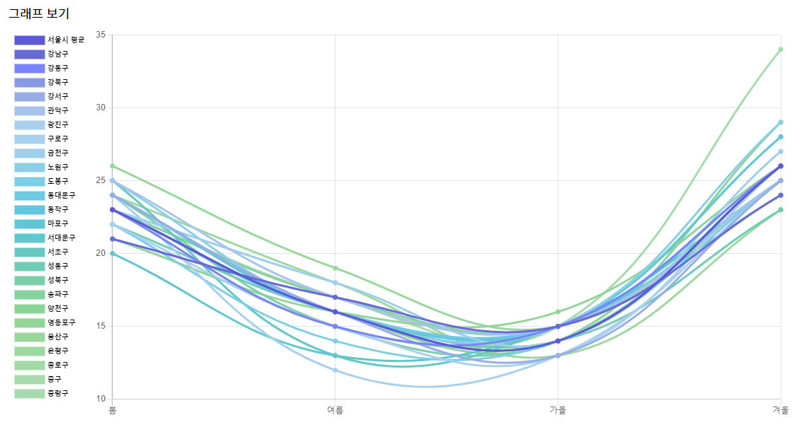

# est_wassup_02

## Get Started
### Environment Setting
실험 환경
- Linux
- Python 3.10

패키지 설치
```
pip install -r requreiment.txt
conda install ipykernel ipywidgets 
```
---
* 프로젝트 기간 01/02 ~ 01/15
## 1. 프로젝트 목적
시계열 프로젝트에 적합한 데이터를 선정하고 과거의 sequence로 미래를 가장 잘 예측한 모델의 최종 결과를 비교 및 선정하기 위해 EDA 이후, 다양한 모델을 사용하여, 모델의 성능을 측정하는 일련의 과정을 파이프라인으로 구축한다.

## 2. 프로젝트 주제 선정
### 서울특별시 종로구의 대기오염 상태 예측
- 예측 데이터
: 서울 종로구의 2023.03~2023.08의 초미세먼지 상태를 예측함

# 주제를 미세먼지가 아닌 초미세먼지로 선정한 이유
: 크기가 2.5㎛ 이하로 미세먼지보다 더 작은 초미세먼지를 흡입했을 때 기도에서 걸러지지 못하고 대부분 폐포까지 침투하여 심장질환과 호흡기질환을 유발하여 조기 사망률을 증가 시키기에 인체에 위험도가 더 높다고 판단한 초미세먼지를 주제로 선정하였다.

          
- 데이터 선정 기준
    1) 자연과학 데이터인가.
    2) 시간의 흐름에 따라 각 변수에 대한 자료를 수집했는가.
    3) 계절성(Seasonal)또는 순환성(Cycle)을 띄는가. 
    4) 잔차 진단(정상성, 정규분포, 자기상관성, 등분산성)이 가능한가. 
    4) 데이터(행)가 미래를 예측하기에 충분한가.
    5) 모델이 학습하고 예측할 적절한 타겟 칼럼이 존재하는가.

## 3. 데이터 수집
- 요구 데이터: 서울특별시 종로구의 대기 정보
- data set 기간: 2018.04 - 2023.08
- data 분석: 초미세먼지가 계절별로 차이가 큰 점을 확인하여 각 계절의 특징을 나타내는 컬럼들을 함께 추가함. (예시로 아래 그래프 확인)

-  2023년 서울특별시 초미세먼지 계절별 그래프

    => 계절에 따른 주요 특징: 온도, 풍향/풍속, 강수량, 일조량, 전운량, 적설양

- 수집한 data set
: 2018.04~2023.08에 확인된 서울특별시 대기환경 정보와 초미세먼지 발생 원인을 분석하여 이와 밀접한 관련이 있는 data를 선정 후 merge.
(일시, 미세먼지농도(PM-10이하), 초미세먼지농도(PM-2.5이하), 오존(o3), 이산화질소(no2), 일산화탄소(co), 아황산가스(so2), 평균기온(°C), 최저기온(°C), 최고기온(°C), 강수 계속시간(hr), 일강수량(mm), 평균 풍속(m/s), 최다풍향(16방위), 최소 상대습도(%), 평균 상대습도(%), 평균 현지기압(hPa), 평균 해면기압(hPa), 합계 일사량(MJ/m2), 일 최심적설(cm), 평균 전운량(1/10), 평균 지면온도(°C), 최저 초상온도(°C))

- 총 데이터량: 2,030
  
- 타겟 데이터 선정

# 최종테스트 성능지표 선정
- MSE, R2-score
## EDA
1. 데이터 이해
2. 데이터 분할
3. 시각화  
4. 결측치 확인 및 merge
    - 일사량 컬럼값 추가
    1) 2018-02-15 → 14.40
    2) 2019-08-28 → 6.80 
    3) 2019-08-29 → 8.22
    4) 2021-01-07 → 6.78
    5) 2022-08-08 → 1.07
    - no2 컬럼값 추가
    1) 2021-06-01~2021-06-30 
5. 범주형 데이터 처리

## 사용한 신경망 모델
- 후보군: RNN, ANN, LSTM, ARIMA, Transformer

## 모델의 성능 평가
- 후보군: MAE, MAPE, MSE, RMSE, R2-score

## Reference
1) 서울시 대기오염 정보: https://cleanair.seoul.go.kr/information/info12#about
2) 미세먼지 원인 분석: https://ko.wikipedia.org/wiki/%EB%AF%B8%EC%84%B8%EB%A8%BC%EC%A7%80
3) 한국기초과학지원연구원: https://m.dongascience.com/news.php?idx=54369
